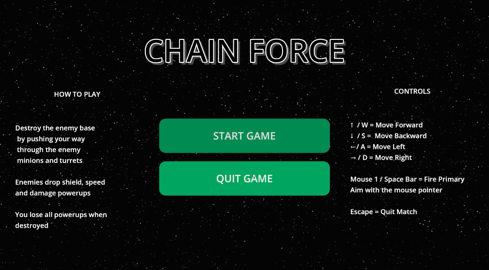
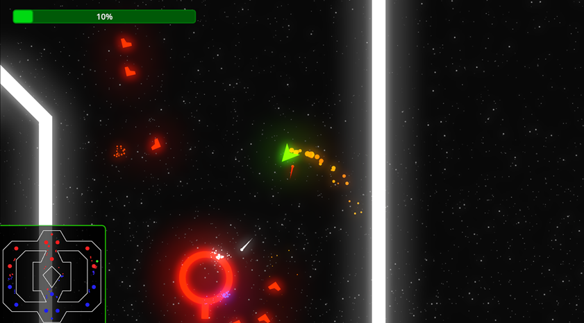
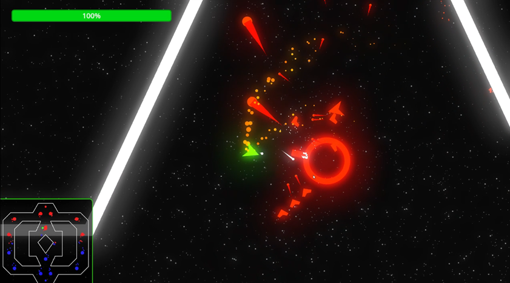
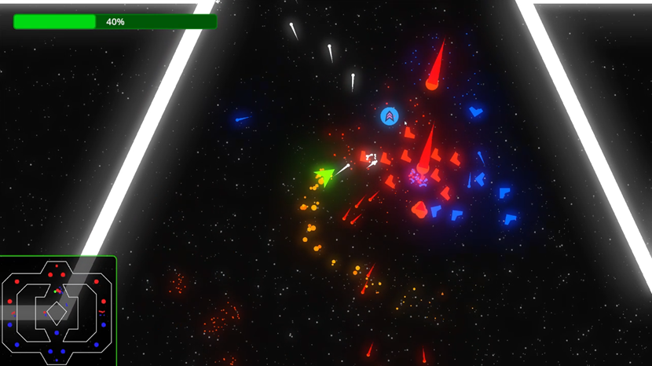
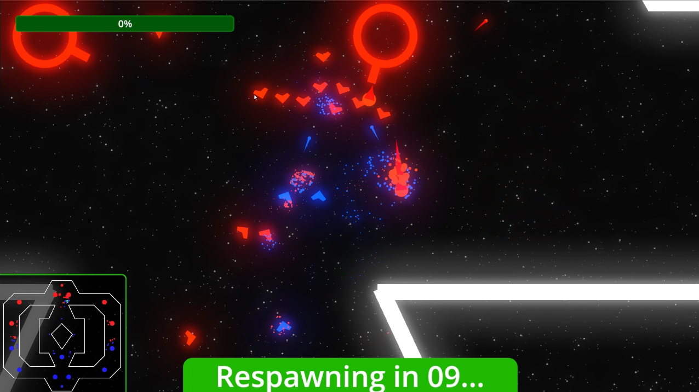

# Harmony - WEB3 Games

## Chain Force - A Web3 SHMUP style MOBA 

1. GITHUB https://github.com/harmony-one/Project-G/blob/main/chainforcedesign.md
2. DOC https://docs.google.com/document/d/1jG2bDX4Xl5TpaqQCO180EKY97cVXcFUhPmCg1TZEa5g
3. Godot 3.5 web3 plugin https://github.com/harmony-one/godot-web3-plugin/
4. Godot 4.x web3 plugin https://github.com/harmony-one/godot-web3-plugin/tree/main-4.2
5. Godot (source) https://github.com/harmony-one/godot
* The Godot web3 SDK builds with Godot 3.5 for MacOSX/Linux and is not currently supported on Windows platforms. The SDK is now buildable on godot 4.x and undergoing testing

5. Playable game demo https://github.com/harmony-one/Project-G/tree/main/game/chainforce_alpha 

## Early Gameplay Screenshots
 
 
 
 
 
 
